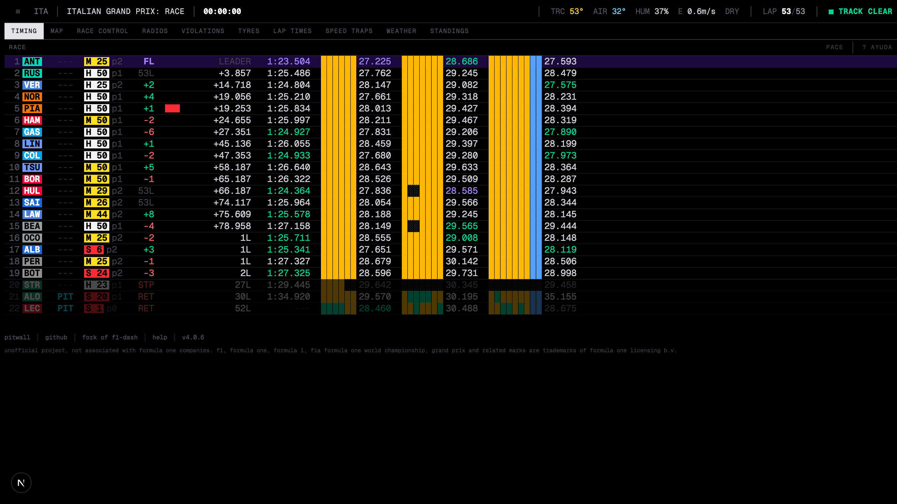

```
> pitwall
```

# pitwall

Real-time **Formula 1 timing & telemetry** in a terminal-style dashboard — leaderboard,
tyres, gaps, lap times, mini sectors, race control, team radios, track map and weather,
updating live during a session.

A fork of [slowlydev/f1-dash](https://github.com/slowlydev/f1-dash), running at
**[f1.ignaciohaffner.com](https://f1.ignaciohaffner.com)**.

[](https://github.com/ignaciohaffner/pitwall/actions/workflows/ci.yaml)



## What this fork changes

- **Terminal UI** — tab-bar navigation, full-width monospace timing table, mini-sectors
  front and center.
- **F1 2026** — updated driver/team data, calendar and session handling.
- **Quali & race views** — the timing screen adapts to the session type (Q1/Q2/Q3
  segments and eliminations in qualifying, positions/gaps/pit in the race).
- **Dev replay mode** — play back a recorded qualifying or race against the dashboard
  when there's no live session. See [`dashboard/dev-sessions/README.md`](dashboard/dev-sessions/README.md).

## Architecture

| Part | Stack | Folder |
|---|---|---|
| dashboard | Next.js 16, React 19, Tailwind, zustand | `dashboard/` |
| realtime | Rust, Axum, SignalR → SSE | `realtime/` |
| api | Rust, Axum (schedule / historical data) | `api/` |

The dashboard talks to `realtime` over SSE (`/api/realtime`) and to `api` over HTTP
(`/api/schedule`). See [`SETUP.md`](SETUP.md) for the docker-compose / k8s setup.

## Running the dashboard

Node version is in [`dashboard/.nvmrc`](dashboard/.nvmrc); package manager is Yarn 4 via
corepack.

```bash
cd dashboard
corepack enable
yarn
cp .env.example .env.local   # point NEXT_PUBLIC_LIVE_URL / API_URL at a backend
yarn dev                      # http://localhost:3000
```

`.env.local`:

```
NEXT_PUBLIC_LIVE_URL=http://localhost:4000   # realtime service
API_URL=http://localhost:4001                # api service
```

For the Rust backend:

```bash
ORIGIN=http://localhost:3000 ADDRESS=0.0.0.0:4000 cargo run -p realtime
ORIGIN=http://localhost:3000 ADDRESS=0.0.0.0:4001 cargo run -p api
```

The live feed only carries data while an F1 session is actually running. Between
sessions, use **dev replay mode** (`?dev=1` on `/dashboard`) to work on the UI.

## Development

- Branch off `develop`, PRs target `develop` (`main` is production).
- Conventional commits (`feat:`, `fix:`, `refactor:`, `perf:`, `chore:`).
- CI (`.github/workflows/ci.yaml`) runs `yarn build` + `yarn lint` + `yarn test` on every push and PR.
- Tests: `yarn test` (Vitest, `src/**/*.test.ts`) — `yarn test:watch` while developing.
- Before a PR: format **only your changed files** with `./node_modules/.bin/prettier --write <files>`
  (`yarn prettier` rewrites the whole tree), then `yarn lint`, `yarn test` and `yarn build`.

## Credits

Built on [f1-dash](https://github.com/slowlydev/f1-dash) by
[slowlydev](https://slowly.dev). Original license applies — see [`LICENSE`](LICENSE).

## Notice

Unofficial project, not associated in any way with the Formula 1 companies. F1, FORMULA
ONE, FORMULA 1, FIA FORMULA ONE WORLD CHAMPIONSHIP, GRAND PRIX and related marks are
trademarks of Formula One Licensing B.V.
